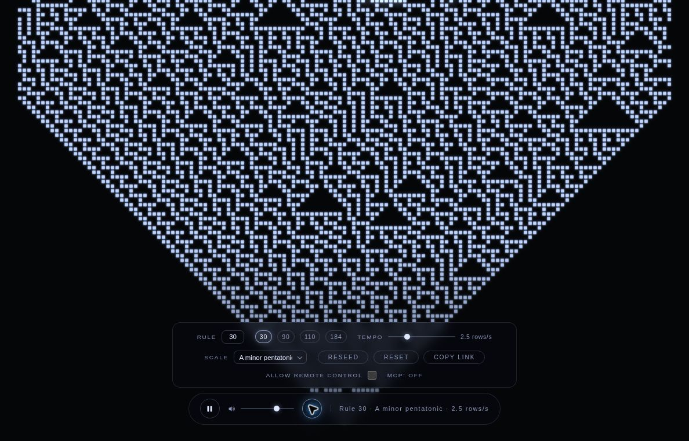
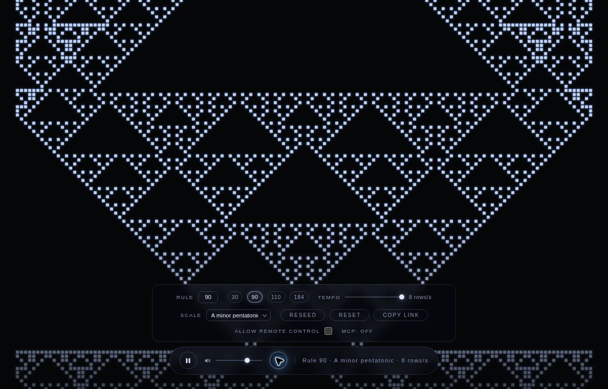
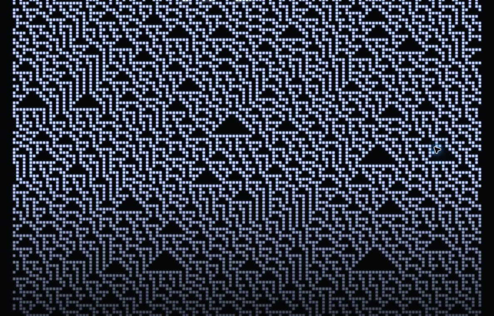

# LOOM

**Change a cellular-automaton rule. Watch it weave. Hear it become music.**

LOOM is a browser-based ambient instrument built from a scrolling cellular automaton, a Canvas tapestry, and a Web Audio synthesizer. New activity in each row maps into musical lanes, creating an evolving piece you can steer with rule, tempo, scale, and seed.

[Play LOOM](https://loom.arrangedgodly.com/) · [Controls](#tune-the-loom) · [Share a configuration](#share-the-settings) · [Local use](#run-locally) · [Optional MCP control](#optional-agent-control)



*Actual live interface. Remote control is off in these captures.*

## Begin, listen, change one thing

Press **Begin** to unlock playback. The default piece uses **Rule 30**, **2.5 rows per second**, **A minor pentatonic**, a centered seed, and **70% volume**.

Let the pattern grow, then move the mouse or use Tab to reveal the controls. Change the rule to hear and see a different structure, slow the tempo, choose another scale, or reseed the starting pattern.

LOOM is a finite, deterministic automaton, not a promise of mathematically endless non-repetition. Its 141 cells wrap around at the edges; the musical and visual behavior follows the selected rule and starting state.

## Tune the loom

| Control | Behavior |
| --- | --- |
| **Begin** | Starts the experience and satisfies the browser’s initial audio gesture |
| **Play / Pause** or Space outside controls with native Space behavior | Run or hold playback |
| **Rule** | Choose an elementary cellular-automaton rule from 0–255 |
| Rule presets | Jump to 30, 90, 110, or 184 |
| **Tempo** | Set 0.5–8 rows per second |
| **Scale** | Choose one of eight pitch collections |
| **Reseed** | Choose a new reproducible unsigned 32-bit seed |
| **Reset** | Restore rule, tempo, scale, and seed defaults while retaining volume |
| **Volume** | Adjust playback level |
| **Copy link** | Share the current configuration through the URL hash |

Scales: **A minor pentatonic, C major pentatonic, A natural minor, C major, D dorian, A hirajoshi, A whole tone, and A blues**.

The app suspends playback when its tab is hidden, then resumes a previously playing session on return. Reduced-motion mode freezes visual animation while audio can continue; use Pause to stop playback.

## The rule changes the weave

| Rule 30 | Rule 90 |
| --- | --- |
|  |  |

*Real app captures. Rule 90 is shown at 8 rows per second, so these demonstrate the visual structures rather than a controlled tempo comparison.*



The visual gives you a history of generated rows. The audio reacts to newly active cells, rather than treating every illuminated cell as a separate note.

## From cells to sound

| Layer | Implementation |
| --- | --- |
| Automaton | A 141-cell wraparound row evolves under the selected 0–255 rule |
| Note selection | Rising activity maps into 12 musical lanes, with at most one note per lane per row |
| Pitch | Lane choices are mapped into the selected scale |
| Synthesis | Triangle plucks, low-pass filtering, compression, and synthesized reverb |
| Scheduling | Notes are scheduled against the Web Audio clock |
| Voice budget | A 32-voice cap bounds concurrent synthesis |
| Visuals | Canvas paints the evolving rows as a tapestry |

The standalone instrument is one `index.html` containing vanilla JavaScript, styles, Canvas rendering, and Web Audio code. It has no frontend framework or external media downloads.

## Share the settings

Copy link encodes these fields in the URL fragment:

```text
#r=<rule>&t=<rowsPerSecond>&s=<scaleId>&d=<seedId>&v=<volume>
```

It carries the **configuration**, not the current playback position, an audio recording, or the history of live parameter changes. Reloading returns to Begin and starts from the shared configuration.

There is no account, localStorage project library, or recording/export interface. The current app does not offer WAV, MP3, MIDI, or image downloads.

## Run locally

For the standalone instrument, open `index.html` in a modern browser and press **Begin**. There is no build step or package-install requirement for that mode.

```sh
git clone https://github.com/Arrangedgodly/loom.git
cd loom
```

The self-contained file is the offline-use path. Hosted infrastructure is separate: do not infer that the public deployment makes no network requests simply because the instrument fits in one file.

## Optional agent control

MCP tools mirror the instrument’s controls so an agent can inspect or adjust an active page. The initial **Begin** gesture still belongs to the person; calling `resume` cannot replace it.

| Tool | Action |
| --- | --- |
| `get_state` | Inspect the current configuration and playback state |
| `set_rule` | Change the automaton rule |
| `set_tempo` | Change row speed |
| `set_scale` | Select a supported scale |
| `reseed` | Change the seed |
| `set_volume` | Adjust volume |
| `pause` / `resume` | Control an initialized playback session |

### Local bridge

The zero-dependency Node companion serves the page and the MCP endpoint:

```sh
node loom-bridge.mjs
```

Open the page with its explicit bridge selector:

```text
http://127.0.0.1:7331/?bridge=http://127.0.0.1:7331
```

Then point the MCP client at:

```text
http://127.0.0.1:7331/mcp
```

Keep the page open and press Begin before asking for audio changes. The explicit `bridge` query matters: the current frontend otherwise selects the newer public WebSocket transport, while the local Node companion serves the SSE bridge.

### Hosted attachment

The hosted endpoint is `https://loom.arrangedgodly.com/mcp`. Page attachment is **off by default** and requires the session-only **Allow remote control** checkbox.

**The public attachment is unauthenticated and shared.** It is not a private per-user control session. There is one active page attachment, and a newer opted-in page supersedes the previous one. Leave the checkbox off when you do not want external control of the instrument.

The hosted system uses a Cloudflare Worker, static assets, and a Durable Object. Full-stack local development is documented through `npx wrangler dev`; review [wrangler.toml](wrangler.toml), [mcp-worker.js](mcp-worker.js), and [loom-bridge.mjs](loom-bridge.mjs) for the distinction between hosted and local transports.

## Verification

Open `?selftest` to run the built-in suites. The current source has **42 individual checks across seven suites** covering automaton, scheduling, synthesis, accessibility foundations, configuration, URL state, and public-attachment invariants. Suite banners are separate from individual check counts.

The live self-test passed all 42 checks during the October 5, 2026 Denver-time review. The review also observed default playback, controls, Rule 90 configuration loading, and pause. It did not test public remote control, the local bridge, offline/file loading, mobile compatibility, or subjective audio quality.

`?fps` enables the performance readout. Test results and instrumentation describe their specific coverage, rather than guaranteeing identical performance or behavior on every device.

## Project records

- [index.html](index.html): instrument, interface, URL state, and built-in tests
- [Local bridge](loom-bridge.mjs): Node companion and local MCP transport
- [Hosted worker](mcp-worker.js): public attachment and hosted MCP tools
- [Project records](docs/ultron/): design decisions, implementation history, and verification notes
